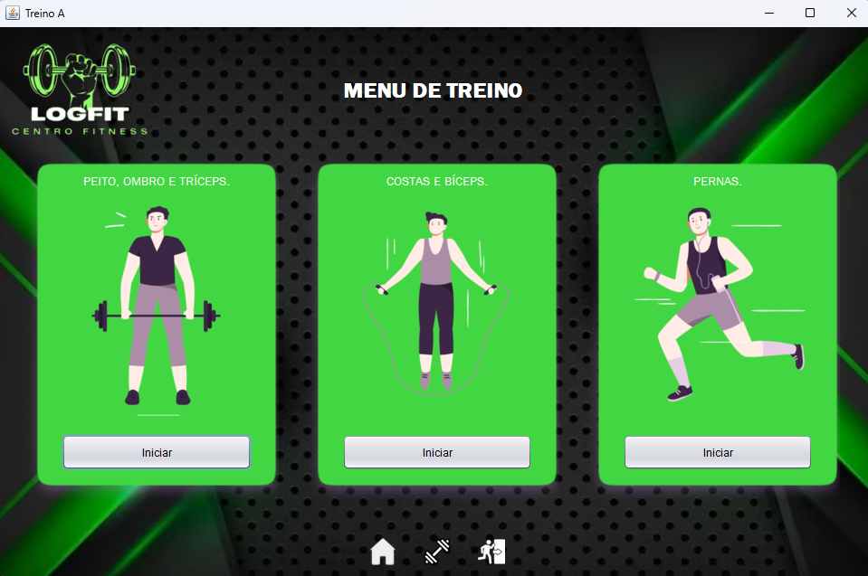
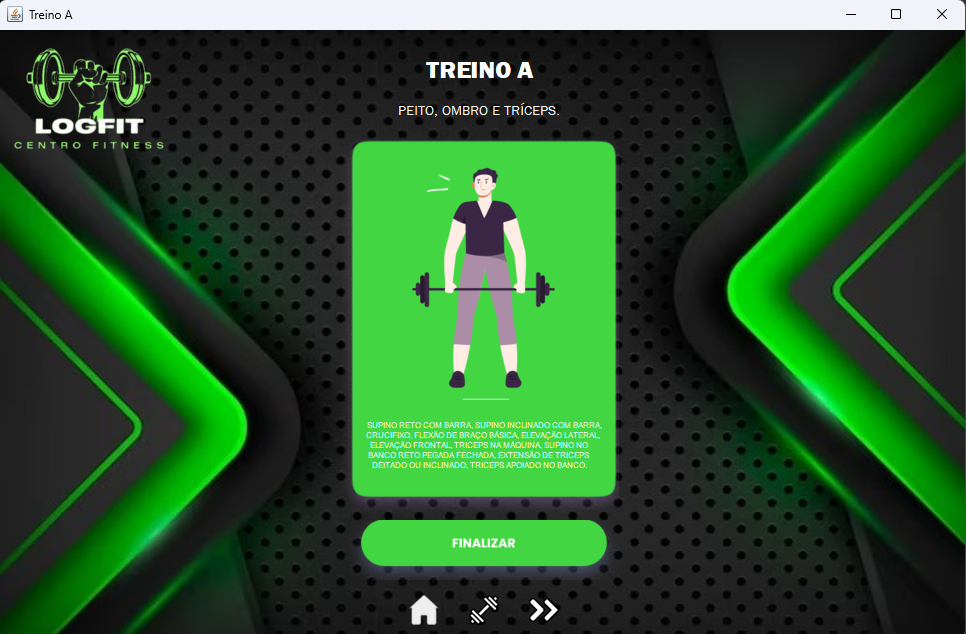
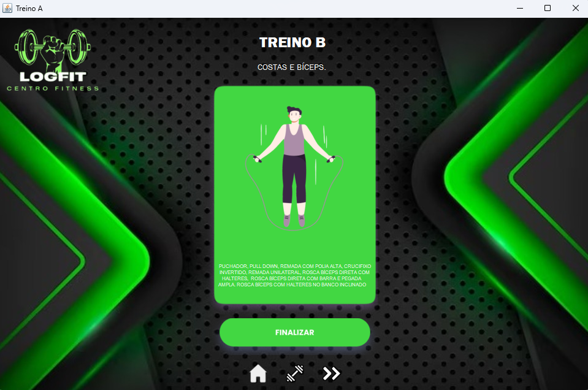

# 🏋️‍♀️ LogFit - Programa de Gerenciamento de Academia

Bem-vindo ao repositório do LogFit! Este projeto foi desenvolvido como parte de um trabalho acadêmico e tem como objetivo oferecer um programa de gerenciamento abrangente para academias. O LogFit permite que academias e centros de fitness gerenciem seus membros, treinamentos, pagamentos e muito mais.

## 📊 Visão Geral:

O LogFit é uma aplicação de software poderosa e fácil de usar, projetada especificamente para atender às necessidades diárias de uma academia. Com recursos abrangentes, nossa solução simplifica o processo de gerenciamento, ajudando a melhorar a eficiência operacional e a experiência dos membros.

## 📜 Tecnologias utilizadas:
* **🍵 [Java](https://www.java.com/pt-BR/):** Linguagem de programação.
* **🧮 [MySQL Workbench](https://www.mysql.com/products/workbench/):** Banco de dados.
* **💻 [Apache NetBeans IDE 17](https://netbeans.apache.org/download/nb17/):** Software de desenvolvimento.

## ⚠️ Como Utilizar:

#### Siga as etapas abaixo para utilizar o LogFit:

* Clone este repositório para o seu ambiente local ou faça o download dos arquivos.
* Certifique-se de ter os requisitos do sistema atendidos. Consulte se tem as dependências necessárias (MySQL Workbench e MySql jdbc Driver). 
* Execute o programa principal em `LogFit\LogFit\dist\LogFit.Jar` para iniciar a aplicação.
* Siga as instruções fornecidas pela interface do programa para começar a utilizar os recursos disponíveis.

## 🖥️ Telas Preview:

  

  

  

  

  

  

  

## 🤝 Colaboradores

Agradecemos às seguintes pessoas que contribuíram para este projeto:

<table>
  <tr>
    <td align="center">
      <a href="#">
         
        
          <b>Victor Moreira</b>
        
      </a>
    </td>
    <td align="center">
      <a href="#">
         
        
          <b>Lucas Rizerio</b>
        
      </a>
    </td>
    <td align="center">
      <a href="#">
         
        
          <b>Erick Monteiro</b>
        
      </a>
    </td>
  </tr>
</table>

## 📝 Licença:

Este projeto é licenciado sob a Licença MIT, o que significa que você tem permissão para usar, copiar, modificar, mesclar, publicar, distribuir, sublicenciar e/ou vender cópias do software, sujeito às condições estabelecidas na licença.
